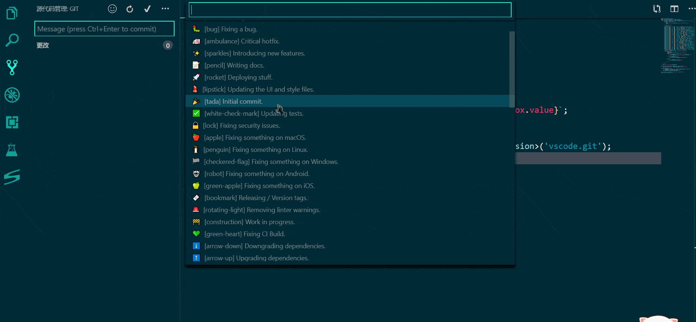

      

# Git Emoji Commit

中文用户可以移步至 ☞ [git-emoji 中文版](https://github.com/maixiaojie/git-emoji-zh)

## Features

Using this vscode plugins on commit messages really very easy.

you can try it if you like git emoji and using vscode!

and you can see after commit:

## download

vscode plugin search `git-emoji`

## issues

[https://github.com/maixiaojie/git-emoji/issues](https://github.com/maixiaojie/git-emoji/issues)

## sources

[https://github.com/maixiaojie/git-emoji](https://github.com/maixiaojie/git-emoji)

## License

The code is available under the [MIT](https://github.com/maixiaojie/git-emoji/blob/master/LICENSE) license.

**Enjoy Your Every Commit!**

## Contributors ✨

Thanks goes to these wonderful people ([emoji key](https://allcontributors.org/docs/en/emoji-key)):

<!-- ALL-CONTRIBUTORS-LIST:START - Do not remove or modify this section -->
<!-- prettier-ignore -->
<table>
  <tr>
    <td align="center"><a href="https://blog.mcust.cn/blogs/maixiaojie"> <b>麦晓杰 lavna</b></a> <a href="https://github.com/maixiaojie/git-emoji/commits?author=maixiaojie" title="Code">💻</a></td>

    <td align="center"><a href="https://github.com/JeromeDeLeon"> <b>Jerome de Leon</b></a> <a href="#design-JeromeDeLeon" title="Design">🎨</a> <a href="https://github.com/maixiaojie/git-emoji/commits?author=JeromeDeLeon" title="Code">💻</a></td>
    
  </tr>
</table>

<!-- ALL-CONTRIBUTORS-LIST:END -->

This project follows the [all-contributors](https://github.com/all-contributors/all-contributors) specification. Contributions of any kind welcome!
