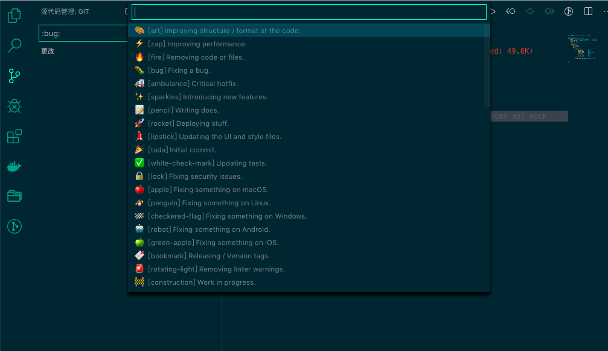

# Git Emoji Commit

中文用户可以移步至 ☞ [git-emoji 中文版](https://github.com/maixiaojie/git-emoji-zh)

## Features

Using this vscode plugins on commit messages really very easy.

you can try it if you like git emoji and using vscode!

## download

vscode plugin search `git-emoji`

## issues

[https://github.com/maixiaojie/git-emoji/issues](https://github.com/maixiaojie/git-emoji/issues)

## sources

[https://github.com/maixiaojie/git-emoji](https://github.com/maixiaojie/git-emoji)

## License

The code is available under the [MIT](https://github.com/maixiaojie/git-emoji/blob/master/LICENSE) license.

**Enjoy Your Every Commit!**
